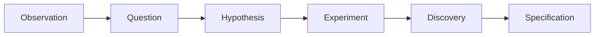

Research is the project's active laboratory. Everything in this section is provisional and may be refined, challenged, or abandoned.

> Research produces Specification. Specification does not produce Research.

## Research lifecycle

Each artifact links to the artifacts that precede and follow it so readers can navigate the evidence chain in both directions.

## Work in the laboratory

- [Research protocol](./protocol/) defines evidence, confidence, counterexample, and promotion rules.
- [Observations](./observations/) record empirical or personal signals without turning them into claims.
- [Questions](./questions/) frame uncertainties that may become hypotheses.
- [Hypotheses](./hypotheses/) state falsifiable claims and predictions.
- [Experiments](./experiments/) document methods, corpora, results, and limitations.
- [Discoveries](../discoveries/) contain validated findings that may support specification changes.
- [Research journal](./journal/) preserves chronological session records, including dead ends and open work.
