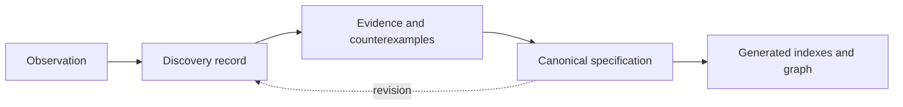

The project separates **working state**, **historical discovery**, and **canonical specification** so that an idea’s origin is not confused with its current standing.

1. Read [Current State](../../current-state/) for active work and unresolved questions.
2. Use discovery records to follow how an observation or hypothesis developed.
3. Use specification pages for the project’s current canonical understanding.
4. Check status, maturity, and confidence labels before treating any claim as established.
5. Follow canonical IDs rather than relying on filenames or titles, which may change.

Search accepts titles, phrases, and page text. The generated catalog also exposes IDs, aliases, tags, and relationships for future structured retrieval.

## From inquiry to navigation

Text equivalent: observations are preserved in discovery records, assessed with evidence and counterexamples, and may inform canonical specifications. Specifications produce indexes and graph data, while later discoveries can lead to revision.
